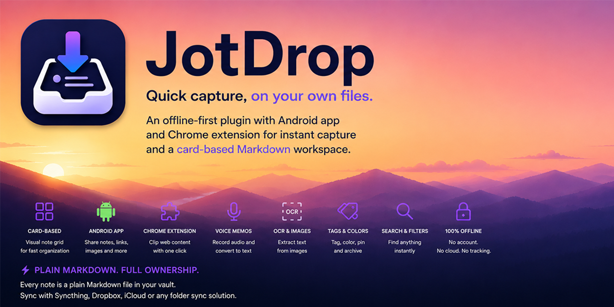
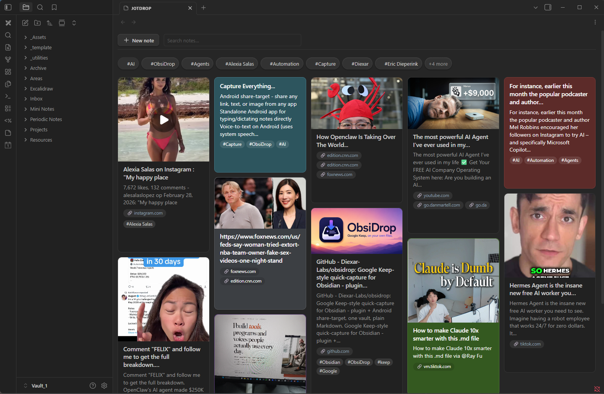
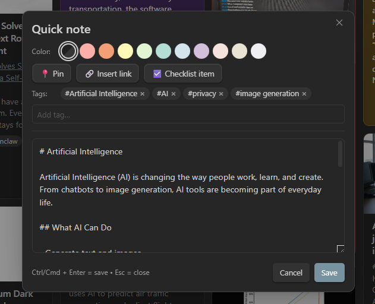
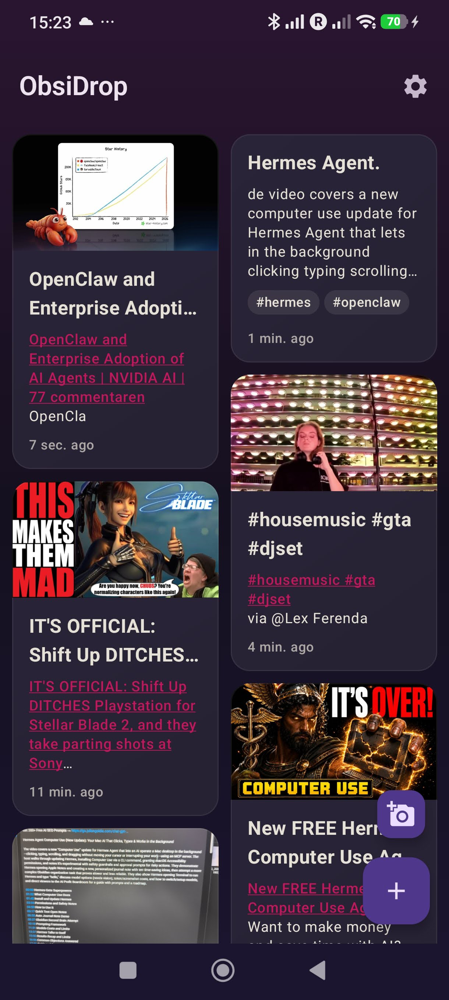

<div align="center">



# JotDrop

**Google Keep, on your own files.**

A card-grid quick-capture for [Obsidian](https://obsidian.md/) with a matching Android share-target app - sync them with [Syncthing](https://syncthing.net/) and you have Keep, fully offline, fully yours.

[](LICENSE)
[](https://github.com/Diexar-Labs/jotdrop/releases)
[](https://github.com/Diexar-Labs/jotdrop/releases)
[](https://github.com/Diexar-Labs/jotdrop/actions/workflows/android-build.yml)

[Download](#install) · [Screenshots](#screenshots) · [How it works](#how-it-works) · [Roadmap](#roadmap)

</div>

---

## Why JotDrop?

Google Keep is great - until you remember Google reads everything you put in there. JotDrop gives you the same fast, friction-free "dump a thought" experience, but every note is a plain Markdown file in your own Obsidian vault. No cloud account, no ads, no telemetry, no lock-in. Sync between phone and laptop with Syncthing (free) or any folder-sync you already use.

- **Quick capture, anywhere.** Share a link from any Android app → JotDrop turns it into a note with a preview card. Open the app, tap once, type, done.
- **Card grid in Obsidian.** A dedicated view shows your notes as Keep-style cards: titles, colors, tags, archived, pinned-on-top. Filter, sort, search.
- **Plain Markdown, always.** Notes are `.md` files with YAML frontmatter. They live in your vault. You can edit them anywhere - Obsidian, VS Code, Vim, mobile.
- **Offline by default.** No server. No account. Works on a plane.
- **Open source, free, no premium tier.** MIT-licensed.

## Screenshots

<p align="center">
  
  <br/><sub><em>Obsidian desktop - Keep-style card grid</em></sub>
</p>

<table>
  <tr>
    <td align="center" width="60%">
      
      <br/><sub><em>Quick-note editor - colors, tags, checklist, pin</em></sub>
    </td>
    <td align="center" width="40%">
      
      <br/><sub><em>Android - home screen</em></sub>
    </td>
  </tr>
</table>

## Features

### Capture
- Android **share-target** - share any link, text, or image from any app
- **Standalone Android app** for typing/dictating notes directly
- **Voice memos** - one-tap recording on the dashboard, on both Android (`.m4a`) and the Obsidian plugin (`.webm`/opus); a confirmation dialog asks before saving, audio lands as a card with an equalizer-banner thumbnail
- **Voice-to-text** on Android (uses system speech recognizer)
- **OCR** on photos via ML Kit (text-recognition v2, bundled in APK - no Google Play Services needed)
- **Link previews** (Open Graph) - paste a URL, get a card with title, image, and source

### Organize
- **Colors** (11 swatches, colorblind-friendly labels)
- **Tags** - typed inline or picked from existing; **filter-chip strip** under the search bar (top-N by frequency, "+N more" sheet for the long tail)
- **Bulk-select** - long-press a card to enter multi-select; bulk archive or delete with confirmation
- **Archive** with one tap, restore anytime
- **Pinned** notes float to the top
- **Search & filter** across body, title, tags
- **Reminders** - per-note due-date with Android notifications; "Due" / "Overdue" badges on the card; survives reboot

### Edit
- Inline **`- [ ]` checklists** with smart toolbar toggle
- **Image embeds** (`![[image.jpg]]`) shown as thumbnails on the card
- **Audio embeds** (`![[memo.m4a]]`) — inline player in both the Android editor and the Obsidian edit modal; tap a voice-memo card to play it back
- **Lightbox** - tap a thumbnail to view full-screen, with "Open externally" fallback
- **Auto-saves** as you type (and on back-button)
- **Live preview** of pasted links
- **Refcount-aware delete** — when you remove a card, its embedded image/audio is moved to the OS recycle bin too, but only if no other card (incl. Archive) still references it (so shared OG-thumbnails stay safe)

### Clip the web
- **Chrome extension** companion - one-click clip of the current page into your vault as a Markdown note, tags included
- Talks only to a localhost server inside the plugin (127.0.0.1, token-authenticated) - no cloud relay

### Sync
- Files written as `<date>-<slug>.md` with YAML frontmatter (color, tags, archived, pinned)
- Designed to coexist peacefully with [Syncthing](https://syncthing.net/) - placeholder + finalize handshake avoids edit-conflicts
- Works with the official Obsidian Sync, iCloud, Dropbox, or any folder sync

## Install

> **TL;DR:** grab the files from the [latest release](https://github.com/Diexar-Labs/jotdrop/releases/latest), drop them in the right place, done. No build tools needed.

### Obsidian plugin (desktop + mobile)

**Easiest — via Community plugins (recommended):**

1. Open Obsidian → Settings → Community plugins → **Browse**.
2. Search for **JotDrop** and click Install, then Enable.
3. Click the sticky-note icon in the left ribbon (or run command "JotDrop: Open Keep view").

**Manual install (for offline / pre-release versions):**

1. Go to the [latest release](https://github.com/Diexar-Labs/jotdrop/releases/latest).
2. Download `manifest.json`, `main.js`, and `styles.css`.
3. Put them in `<your-vault>/.obsidian/plugins/jotdrop/` (create the folder if it doesn't exist).
4. Open Obsidian → Settings → Community plugins → enable **JotDrop**.

### Android app

1. Download `jotdrop-debug.apk` from the [latest release](https://github.com/Diexar-Labs/jotdrop/releases/latest).
2. Open the file on your phone → Android will ask permission to install from unknown sources → grant it.
3. Open JotDrop → first screen lets you pick the vault folder (the same one you sync to your laptop).
4. From now on, the share-sheet in any app includes JotDrop.

> **Note:** the APK is debug-signed (so you can install over a previous version without uninstalling). It's safe - built by GitHub Actions in this repo, you can see the build log on the releases page.

### Syncing the two

Install [Syncthing](https://syncthing.net/) on phone + laptop, point both at your vault folder. Within 30 seconds of capturing on your phone, the note shows up in Obsidian. That's the entire setup.

> **Recommended Syncthing setting:** enable **File Versioning** on the shared folder (Simple Versioning is fine), on both devices. Deleted and overwritten files are kept in `.stversions/` so an accidental delete — or a sync race, see [Known issues](#known-issues) — is recoverable instead of permanent.

### Chrome extension (optional web clipper)

1. In the Obsidian plugin's settings, enable **Web clipper** under "Clip server" and copy the token.
2. Load the [`chrome-extension/`](chrome-extension/) folder as an unpacked extension in Chrome (`chrome://extensions` → Developer mode → Load unpacked).
3. Open the extension's Options page, paste the token, save.
4. Click the JotDrop icon on any page to clip the URL + title + selection (if any) into your vault as a Markdown note.

The clip server only binds to `127.0.0.1` and never exposes itself on the network. Off by default.

## How it works

JotDrop is intentionally simple plumbing:

- Each note is a plain Markdown file in `<vault>/Mini Notes/` (folder configurable).
- Metadata lives in YAML frontmatter at the top:
  ```yaml
  ---
  color: amber
  tags: [idea, work]
  archived: false
  pinned: false
  ---
  ```
- The Android app writes the file. The Obsidian plugin reads it. They never talk to each other - they meet in the vault.
- Link-preview cards are written as a "pending" placeholder by Android, then the plugin (or Android) fetches the Open Graph data and rewrites the note. A race-safe marker check prevents either side from overwriting user edits.

This is why JotDrop **needs no server, no account, no API key** - and why anything that can write to the same folder (e.g. a `curl` script, a Shortcuts automation) can capture into it.

## Known issues

### Bulk delete while a sync peer is offline

If you bulk-delete many notes in the plugin while another device (phone or laptop) running Syncthing is **offline**, the deletes may be "resurrected" when that peer reconnects: the offline peer still has those files with valid version metadata, and on reconnect Syncthing can side with the peer and push the files back to the device that deleted them.

This is Syncthing reconciliation behavior, not specific to JotDrop — single deletes you do while everything is online propagate fine. It's the combination of *bulk* delete and an *offline* peer that triggers it. Mitigations:

- Make sure Syncthing is **running on every device** before bulk-deleting, and stays running for ~30s after so the deletes propagate.
- Enable **File Versioning** in Syncthing (see [Syncing the two](#syncing-the-two)). Even if files do come back, you have copies in `.stversions/` to delete from properly.
- The bulk-delete confirmation dialog reminds you of this — it's not paranoia, it's avoiding this exact failure mode.

## Languages

UI in English (default) and Dutch. Skeletons exist for **Spanish, German, French, Italian** - empty files are present in [`src/i18n.ts`](src/i18n.ts) and [`android/app/src/main/res/values-*/`](android/app/src/main/res/). PRs with translations very welcome - see [Contributing](#contributing).

## Roadmap

- [x] Card grid in Obsidian
- [x] Android share-target
- [x] OCR + voice-to-text on Android
- [x] Link previews (Open Graph)
- [x] Checklists
- [x] Multi-language (EN/NL + skeletons)
- [x] Reminders / due-dates
- [x] Web clipper (Chrome extension)
- [x] Tag-filter chips + bulk-select (multi-archive / multi-delete)
- [x] Lightbox for image embeds
- [x] Voice memos (record + playback, both platforms)
- [x] Submit to official Obsidian community-plugins register
- [ ] iOS share-target (share-extension)
- [ ] Firefox / Edge clipper (the Chrome extension is MV3, should port cleanly)

## Contributing

This is a hobby project I share publicly. PRs welcome for:
- **Translations** - drop strings into `src/i18n.ts` and the matching `android/.../values-*/strings.xml`
- **Bug fixes**
- **Small features** that fit the "minimal" philosophy

For larger ideas, open an issue first to chat about it. No CLA, no commit-message gatekeeping; just keep it tidy.

## Support

Open source, MIT-licensed, no premium tiers. If JotDrop saves you time and you feel like saying thanks:

<a href="https://ko-fi.com/L3L11ZETB9"></a>
&nbsp;
<!-- GitHub Sponsors badge will be added once approval is in -->

No subscriptions, no obligations, no DMs. Totally optional.

## Build from source

If you'd rather build yourself than trust a debug APK:

**Plugin:**
```bash
npm install
npm run build
# main.js + manifest.json + styles.css end up in repo root
```

**Android:**
```bash
cd android
gradle :app:assembleDebug
# APK at android/app/build/outputs/apk/debug/app-debug.apk
```

Requires JDK 17, Android SDK 34, and Gradle 8.7 (the wrapper jar isn't committed - either install Gradle system-wide or run `gradle wrapper` once to generate `./gradlew`).

## Credits

Built by [Diexar Labs](https://github.com/Diexar-Labs). Uses [Obsidian's plugin API](https://docs.obsidian.md/Plugins/Getting+started/Build+a+plugin), [Jetpack Compose](https://developer.android.com/jetpack/compose), and Google's [ML Kit Text Recognition](https://developers.google.com/ml-kit/vision/text-recognition).

Inspired by Google Keep (the good parts) and by [the Obsidian community's](https://obsidian.md/community) belief that your notes belong to you.

## License

[MIT](LICENSE) - do whatever you want with it.
